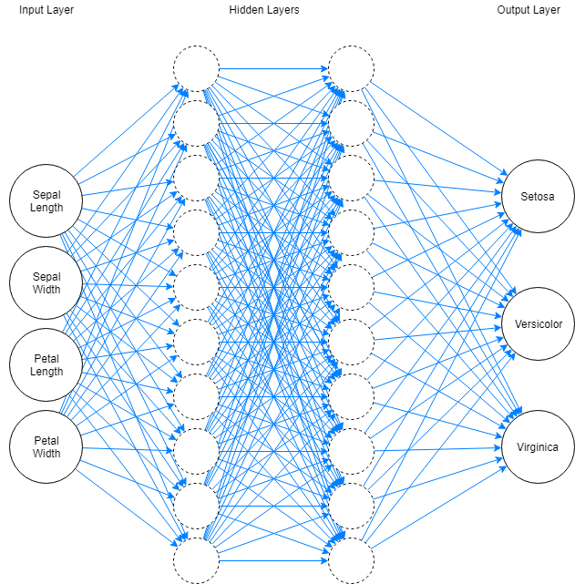

# TensorFlow Sample
A Very Basic TensorFlow Sample Project


This project is meant to show a simple use of a deep neural network with TensorFlow to classify the [Iris Dataset](http://archive.ics.uci.edu/ml/datasets/Iris). This project is meant to show off a clean and simple use of the high-level APIs exposed by TensorFlow. Many of the "hello world" or introductory samples I've found tend to start off with lower level components of TensorFlow, or involve a lot of "plumbing" before you actually get to the relevant part of the solution. This is how to create a deep neural network to classify a well known dataset in ~20 lines of code.


## Install Dependencies:

First, [Install TensorFlow](https://www.tensorflow.org/install/).

We also use [pandas](https://pandas.pydata.org/) for reading in and manipulating the data file, so run:

```
pip install pandas
```

## Background

The iris dataset we're using is a well known machine learning dataset that includes measurements of 150 iris flowers of three different species. The measurements are of sepal length, sepal width, pedal length, and pedal width. The idea is that we should be able to figure out the species from those measurements with some degree of accuracy. I've gotten 95-99% accuracy on most runs of this example.

So basically, given a bunch of data like this,

|Sepal Length|Sepal Width|Pedal Length|Pedal Width|Species        |
|------------|-----------|------------|-----------|---------------|
|4.8         |3.1        |1.6         |0.2        |Iris-setosa    |
|5.8         |2.7        |4.1         |1.0        |Iris-versicolor|
|6.4         |2.7        |5.3         |1.9        |Iris-virginica |

[Full Dataset](https://github.com/edamtoft/TensorFlowSample/blob/master/iris.data.csv)

We want to be able to figure out the species of this iris:

|Sepal Length|Sepal Width|Pedal Length|Pedal Width|Species        |
|------------|-----------|------------|-----------|---------------|
|6.8         |2.8        |4.8         |1.4        |??????         |

We'll be using a pre-built [Deep Neural Network](https://en.wikipedia.org/wiki/Deep_learning#Deep_neural_networks) classifier provided in TensorFlow. A neural network is a network of N inputs (in this case 4 - one for each measurement), N outputs (in this case 3 - one for each possible species), and some amount of interconnected "hidden" layers in between. Anything with more than one hidden layer is a "deep" neural network. There is no real magic formula for how many hidden layers you should have or how many nodes each one should contain - you generally have to tweak this until you find a balance of performance/accuracy which fits your problem. We're arbitrarily using 2 hidden layers with 10 nodes each. In this case, this may be overkill, but this is just an example.



## In Depth

### Preparing the Data

```python
data = pd.read_csv("./iris.data.csv", names=measurements+["Species"])

test_features = data.sample(frac=0.2)
train_features = data.drop(test_features.index)

train_labels = train_features.pop("Species")
test_labels = test_features.pop("Species")
```

In this snippet, we're just setting up the data. We need to split the data into training and testing data because one of the major concerns with a machine learning algorithm is over-fitting the training data such that the model is not generalizable. In our case, we save 20% of the data for testing, and use the rest for training. The we separate out the labels (the value we're trying to figure out, in our case the species of the iris) from the features (the values we'll be using to figure out the species).

We're using [pandas](https://pandas.pydata.org/) here because it's concise, and TensorFlow has some pre-built functions for reading in data from pandas which will make our lives easier later on.


### Defining the Columns

```python
columns = [tf.feature_column.numeric_column(key=column) for column in measurements]
```

In this snippet, we're taking the names of the measurements (which are the columns of our dataset we will try to determine the species based on) and mapping them to a TensorFlow [feature column](https://www.tensorflow.org/versions/master/get_started/feature_columns). These tell the classifier how to interpret the data it's seeing. In this case, the measurements are all numeric, so this is pretty simple.

### Creating the Estimator

```python
classifier = tf.estimator.DNNClassifier(
  feature_columns=columns,
  hidden_units=[10,10],
  label_vocabulary=species,
  n_classes=len(species))
```

In this snippet, we're creating a [Deep Neural Network classifier](https://www.tensorflow.org/api_docs/python/tf/estimator/DNNClassifier), which is a pre-built high-level estimator provided by TensorFlow.

A classification algorithm is a machine learning algorithm where the result is probabilities of an item being a member of one of several "classes". For the Iris dataset, this is exactly what we need because we're determining the probability of a flower's species being setosa, versicolor, or virginica based on it's measurements.

If we wanted to do the opposite, and determine what a measurement was based off the species and some other measurements, we'd use a regression algorithm. Tensorflow supplies a several pre-build classifiers and regressors to choose from.

### Defining Input Functions

```python
train_input_fn = tf.estimator.inputs.pandas_input_fn(x=train_features,y=train_labels,shuffle=True,batch_size=50,num_epochs=100)
test_input_fn = tf.estimator.inputs.pandas_input_fn(x=test_features,y=test_labels,shuffle=True,batch_size=50,num_epochs=100)
```

In this snippet, we're defining two input functions. TensorFlow uses input functions to get data in batches from a data source. Fortunately, TensorFlow provides a [built-in method](https://www.tensorflow.org/api_docs/python/tf/estimator/inputs/pandas_input_fn) for converting a pandas DataFrame into an input method. We specify the x (features) and y (labels) data sets we prepared earlier, instruct it to randomize the input, and iterate though it in batches of 50, repeating the original dataset up to 100 times. These are both somewhat arbitrary values, but since there are 150 values in our initial data, this will ensure that each time though it will be a somewhat different subset of the data which will help reduce over-matching.

If we weren't using pandas, we could use TensorFlow [DataSets](https://www.tensorflow.org/get_started/datasets_quickstart#basic_input) to create the input function.

### Training the Classifier

```python
classifier.train(input_fn=train_input_fn)
```

This part is pretty self-explanitory. It will run through the data in the batches we set up above, and train the model based on the labels we supplied. We can also manually specify a "steps" parameter that tells it how many batches to run through but by default it will just run until the input function has run to completion.

### Evaluate the Classifier

 ```python
 evaluation = classifier.evaluate(input_fn=test_input_fn)
 ```

 This part is also pretty self-explanitory. It runs through the test data we set aside earlier and compares what the algorithm predicted vs the known label and returns a result with the accuracy, among other statistics. If all goes well, this should be well above 95%.

 ### Predict an Unlabeled Item

```python
predict_features = pd.DataFrame.from_dict({
    "SepalLength": [6.8],
    "SepalWidth": [2.8],
    "PedalLength": [4.8],
    "PedalWidth": [1.4]
})

predictions = classifier.predict(input_fn=tf.estimator.inputs.pandas_input_fn(x=predict_features,shuffle=False))

prediction = next(predictions)
class_id = prediction["class_ids"][0]
probability = prediction["probabilities"][class_id]
species = species[class_id]
print("prediction is {species} with {probability:.3f}% certainty".format(species=species, probability=probability*100))
```

Now we can actually use the neural network to do something useful! It's trained and evaluated, so we'll use it to predict the species of a single iris based on the pedal measurements. The predict method returns a generator of results. Since we just want a single result, we just call next() on it and grab out the species and probability based on the class_id of the prediction.